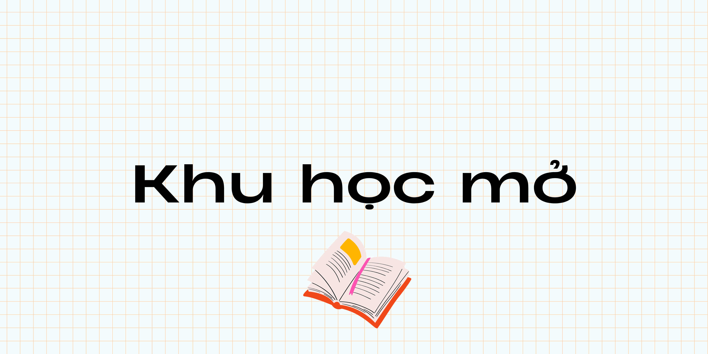

Hiện tại bạn đang truy cập trang xây dựng dự án của Khu học mở. Nếu bạn muốn bắt đầu tự học một nội dung gì mới, hãy truy cập trang [Khu học mở](https://daihocmo.github.io/) (Bấm vào đường dẫn là xong).

### Giới thiệu

Khu học mở là một trang được tạo ra để hỗ trợ mình (yep, cho *mình*) trong quá trình học tập suốt đời. Mong là nó cũng sẽ giúp mọi người tìm được hướng đi thích hợp cho sự học của bản thân.

Các tài liệu, nội dung học tập và nguồn học được sưu tầm ở trên đây hoàn toàn miễn phí, chỉ cần mọi người có một chiếc máy tính kết nối được với mạng là bạn có thể bắt đầu học được gần như mọi thứ.

### Đóng góp & Xây dựng Khu học mở

Khu học mở cũng quản lý toàn bộ dự án, thảo luận và góp ý trên Github. Trong mỗi trang của Khu học mở đều có đường dẫn đến trang Github của trang web tương ứng.

### Một số thắc mắc
- **Học ở Khu học mở có miễn phí không?** Hmm, không chỉ miễn phí, mà còn "free" (tự do, miễn phí) nữa. Bản thân Khu học mở là một trang để định hướng người học những cách để có thể học tập hiệu quả hơn và các nguồn tài nguyên học tập cũng được tổng hợp từ nhiều nguồn trên Internet.
- **"Khu học mở" có liên quan gì đến "Đại học mở Hà Nội" hay "Đại học mở TPHCM" không?** Không nha, ý tưởng cho tên về cơ bản chỉ là Đại học mở, kiểu "Open University" ấy, nhưng rồi đổi sang Khu học mở để cho đỡ trùng tên với mấy trường đại học.

### Bản quyền
Các nội dung trên trang do mình viết đều được phát hành dưới giấy phép GPL3 & Unlicense (Public Domain). Nhưng với các nội dung, tài nguyên được chia sẻ trên trang thì để có thể được sử dụng nội dung cho mục đích khác, mọi người vui lòng kiểm tra giấy phép phát hành của trang, với các trang được phát hành dưới giấy phép mã nguồn mở (Như trang này) hoặc Creative Commons thì bạn có thể chia sẻ lại (với điều kiện phải kèm nguồn đầy đủ). 

Các tài nguyên học tập mình chia sẻ trong đây chỉ nên được sử dụng với mục đích học tập và giáo dục. Cá nhân mình (cũng như toàn bộ Khu học mở) sẽ không chịu trách nhiệm nếu có bất kì vấn đề nào liên quan đến bản quyền do người học gây ra.

Với các bài viết được ghi nguồn, nếu tác giả của các bài viết tương ứng được đề cập ở mục nguồn muốn gửi yêu cầu gỡ bài thì vui lòng gửi yêu cầu qua [Email](mailto:duykhanh471@protonmail.com). Mình sẽ phản hồi lại Email và gỡ bài viết sau 7 ngày kể từ ngày nhận được Email. Cảm ơn mọi người vì những hướng dẫn học tập tuyệt vời.

